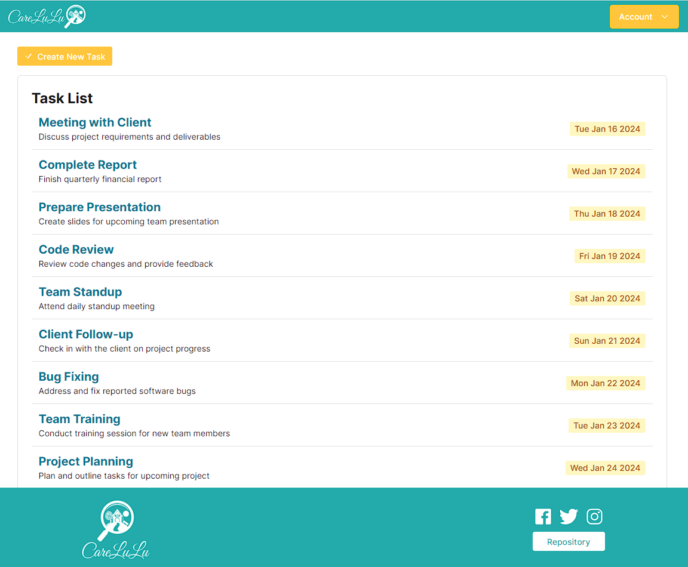

[](https://github.com/ceduarte25/task-list)

# Task List

---

## Author

- Christian Eduarte

---

## Intuition

I didn't know the techstack of Apollo Client, Apollo GraphQL, so I studied it first then create a backend for testing if my endpoints will work. After building foundation for the backend, I built the frontend foundation, then after that I code on both ends simultaneously.

---

## How to use

1. Clone the repository (replace `task-list` with `.` to clone it in the current directory).
```
git clone https://github.com/ceduarte25/task-list.git task-list
```
2. Open terminal and go to the backend directory,
```
cd task-list/backend
```
&nbsp;&nbsp;&nbsp;&nbsp;&nbsp;&nbsp;&nbsp;&nbsp;or if you installed it in the current directory,
```
cd backend
```
&nbsp;&nbsp;&nbsp;&nbsp;&nbsp;&nbsp;&nbsp;&nbsp;then run npm install.
```
npm install
```
3. create a `.env` file in the backend directory (`backend/.env`) and copy the example layout in `.env.example`, then change your username and password according to your MySQL configuration (Make sure to have MySQL installed in your PC). After that you can push prisma to your database.
```
npx prisma db push
```
4. Open another terminal and go to the frontend directory to run npm install for frontend components (you should have two terminals now),
```
cd task-list/frontend
```
&nbsp;&nbsp;&nbsp;&nbsp;&nbsp;&nbsp;&nbsp;&nbsp;or,
```
cd frontend
```
&nbsp;&nbsp;&nbsp;&nbsp;&nbsp;&nbsp;&nbsp;&nbsp;then run npm install again for frontend components.
```
npm install
```
5. Run npm run dev on both terminals that you have opened, for both backend and frontend (Make sure ports 3000 and 3333 are not busy).

&nbsp;&nbsp;&nbsp;&nbsp;&nbsp;&nbsp;&nbsp;&nbsp;`(for frontend directory)`
```
npm run dev
```
&nbsp;&nbsp;&nbsp;&nbsp;&nbsp;&nbsp;&nbsp;&nbsp;`(for backend directory)`
```
npm run dev
```
6. Visit http://localhost:3000/, then refresh the page one or two times for the components to load. (you don't have to refresh in production environment, but for development environment it is needed)

---

## Techonoly Used

**Frontend:** React, Apollo Client, NextJs, Radix, ReactIcons, Tailwind CSS

**Backend:** Apollo Server, Apollo GraphQL, NodeJs, ExpressJs, Prisma, MySQL

---

## License

Licensed under the MIT License, Copyright © 2024-present [Christian Eduarte](https://github.com/ceduarte25).

See [LICENSE](./LICENSE) for more information.
